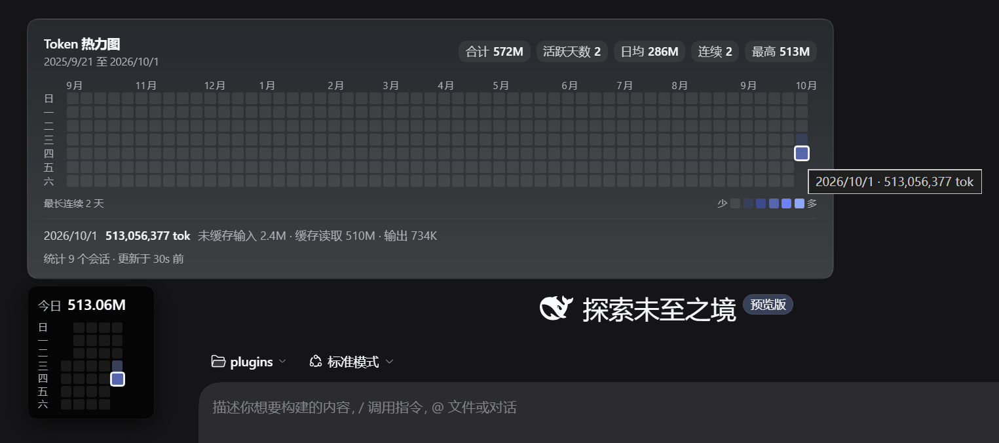
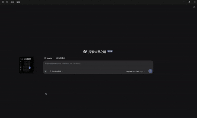

# dsh-token-heatmap

[English](./README.en.md) | **中文**

一个可拖动的浮动窗口，用 GitHub 贡献图的形式显示你的 DeepSeek Harness token 用量：
最上面是今天的总量，下面是最近 30 天，悬停时上方会展开一整年的面板。



## 安装

需要装有 Plugin Manager 的 DeepSeek Harness。打开侧边栏的 **Plugins** 页面，安装这个 spec：

```
github:cccchensy/dsh-token-heatmap
```

或者直接在任意会话里对 agent 说：*安装插件 `github:cccchensy/dsh-token-heatmap`*。
如果你已经 clone 了仓库，就改成安装它的目录路径。

装好后窗口会出现在对话区的左下角。卸载在同一个 Plugins 页面里操作。

- 插件按 profile 生效，重启后依然存在。
- **更新插件后要重启 DSH** —— 替换已安装的包需要重启才能加载新代码。
- 数据不会离开你的机器。它读取你自己的会话日志，并在进程内返回聚合结果：
  没有网络请求，也没有遥测。

## 使用




- **拖动**可把它移到任意位置，位置会被记住。
- **悬停**会在上方展开年度面板：总量、活跃天数、日均、当前与最长连续天数、
  最佳单日、颜色图例，以及每一天的输入 / 缓存 / 输出拆分。
- **双击**可把它折叠成只剩标题行。
- **只要有会话在运行，窗口就会缓慢闪烁**，最后一个会话结束后停止。
  窗口内部没有任何动画，所以数字不会闪。

## 局限

- 今天的数字准确到最后一个已提交的 step，而不是最后一个生成的 token。
- 统计规则与 Harness 的用量胶囊一致（对普通的 Turn 而言），但有一个已知差距：
  **被重试的 step 会被少算** —— 这里只折叠 `assistant/message` 事件，
  而官方总计还会把每次 `assistant/attempt` 也加起来。
- 闪烁表示「有会话在运行」，而不是「此刻正在消耗 token」。

## 开发

```
node verify.mjs          # token 规则 + 对真实会话日志做一次扫描
node verify-client.mjs   # 浏览器侧 bundle
node verify-host.mjs     # HTTP 路由，端到端
```

可调的开关 —— 窗口长度、是否统计 subagent、扫描并发度、新鲜度窗口 —— 都在
[`lib/config.js`](lib/config.js) 里。Host 侧是不带任何依赖、无需构建的纯 ESM。

MIT 许可。
